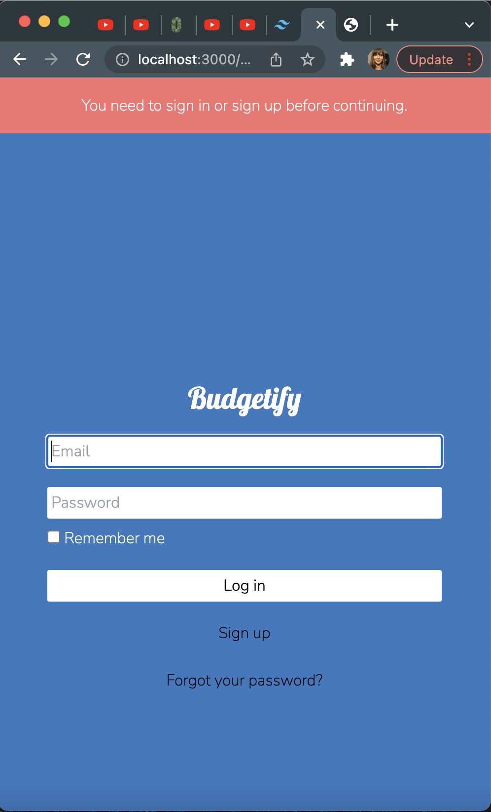
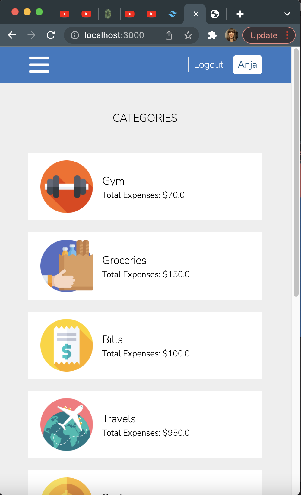

# My Budgeting App

This mobile app allows the user to manage their personal finances by keeping track of their expenses.

 

## 🪛 Built with
Ruby on Rails

 

## 🚀 Live Demo

You can see the live demo of this mobile app [here](https://boiling-falls-90821.herokuapp.com/users/sign_in).

 

<h3>Installing Rails</h3>

Before you install Rails, you should check to make sure that your system has the proper prerequisites installed. These include:

    Ruby
    SQLite3
    Node.js
    Yarn

 

<h3>Installing Ruby</h3>

Open up a command line prompt. On macOS open Terminal.app; on Windows choose "Run" from your Start menu and type cmd.exe. Any commands prefaced with a dollar sign $ should be run in the command line. Verify that you have a current version of Ruby installed:

`$ ruby --version
ruby 2.7.0`

Rails requires Ruby version 2.7.0 or later. It is preferred to use latest Ruby version. If the version number returned is less than that number (such as 2.3.7, or 1.8.7), you'll need to install a fresh copy of Ruby.

To install Rails on Windows, you'll first need to install [Ruby Installer](https://rubyinstaller.org/).

 

<h3>Installing SQLite3</h3>

You will also need an installation of the SQLite3 database.

Verify that it is correctly installed and in your load PATH:

`$ sqlite3 --version`

The program should report its version.

 
<h3>Installing Node.js and Yarn</h3>

Finally, you'll need Node.js and Yarn installed to manage your application's JavaScript.

Find the installation instructions at the [Node.js website](https://nodejs.org/en/download/) and verify it's installed correctly with the following command:

`$ node --version`

The version of your Node.js runtime should be printed out. Make sure it's greater than 8.16.0.

To install Yarn, follow the installation instructions at the [Yarn website](https://classic.yarnpkg.com/en/docs/install).

Running this command should print out Yarn version:

`$ yarn --version`

If it says something like "1.22.0", Yarn has been installed correctly.

 
<h3>Installing Rails</h3>

To install Rails, use the gem install command provided by RubyGems:

`$ gem install rails`

 
<h3>Running the app</h3>
To run the app in your browser, simply run the following command in your terminal:

`$ rails s`

Then, open https://localhost:3000 in your browser to view the app.

 

### Testing

To run the tests run `bundle exec rspec` in your console. Then, run `rspec spec/folder_name/file_name_spec.rb`.

 

## ✏️ Authors

👤 **Anja**

- GitHub: [@Anjacodes](https://github.com/Anjacodes)
- Twitter: [@Anja_Schmidt7](https://twitter.com/Anja_Schmidt7)
- LinkedIn: [LinkedIn](https://www.linkedin.com/in/anja-schmidt7/)

 

## 🤝 Contributing

Contributions, issues, and feature requests are welcome!

Feel free to check the [issues page](../../issues/).

## Show your support

Give a ⭐️ if you like this project!

 

## Acknowledgments

Original design idea by [Gregoire Vella on Behance](https://www.behance.net/gregoirevella).

 

## 📝 License

This project is [MIT](https://github.com/microverseinc/readme-template/blob/master/MIT.md) licensed.
